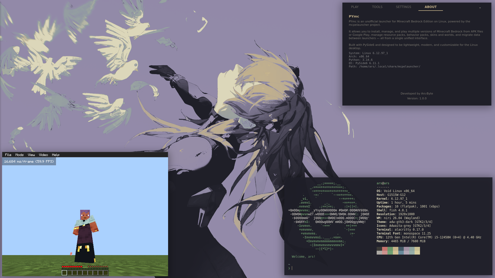

# PYmc

[](https://www.python.org/)


[](https://www.qt.io/qt-for-python)
[](https://www.kernel.org/)
[](LICENSE)

> Website: [ars-byte.github.io/pymc-website](https://ars-byte.github.io/pymc-website/)

A modern graphical launcher for **Minecraft: Bedrock Edition** on Linux, built with PySide6 (Qt6) and powered by the [mcpelauncher](https://github.com/minecraft-linux/mcpelauncher-manifest) project.

---

## Installation

### Void Linux (xbps)

```bash
xbps-rindex -a pymc-1.0.0_1.x86_64.xbps
doas xbps-install -R $PWD pymc
pymc
```

### Debian/Ubuntu (.deb)

```bash
sudo dpkg -i pymc-1.0.0-amd64.deb
sudo apt install -f
pymc
```

### AppImage (Universal)

```bash
chmod +x PYmc-1.0.0-x86_64.AppImage
./PYmc-1.0.0-x86_64.AppImage
```

### Portable

```bash
tar xzf PYmc-v1.0.0.tar.gz
cd PYmc-v1.0.0
./pymc.sh
```

### NixOS

```bash
# flake.nix
inputs.pymc.url = "github:Ars-byte/PYmc";
environment.systemPackages = [ inputs.pymc.packages.${system}.default ];
sudo nixos-rebuild switch
```

### From Source

```bash
git clone https://github.com/Ars-byte/PYmc.git
cd PYmc
python3 -m venv venv && source venv/bin/activate
pip install -r requirements.txt
./run.sh
```

---

## Features




- **Version management** — install, switch, and play multiple Minecraft Bedrock versions from APK or Google Play
- **Resource manager** — manage resource packs, behavior packs, skins and worlds
- **Mod support** — browse and install mods from the official mcpelauncher-moddb repository
- **7 dark themes** — Tokyo Night, Catppuccin, Dracula, Nord, Everforest, One Dark, Rose Pine
- **8 languages** — English, Spanish, German, French, Italian, Portuguese, Catalan, Japanese
- **Auto-download** — downloads mcpelauncher binaries automatically if not found

---

## Requirements

- **Linux** x86_64
- **Python** 3.10 or newer
- **OpenGL ES 3.0** or higher

### System Dependencies

```bash
# Void Linux
doas xbps-install qt6-webengine qt6-declarative qt6-webchannel qt6-position libzip unzip zenity

# Debian/Ubuntu
sudo apt install qt6-webengine-dev qt6-declarative-dev libqt6webchannel6 libzip-dev unzip zenity

# Arch
sudo pacman -S qt6-webengine qt6-declarative qt6-webchannel libzip unzip zenity
```

---

## License

GNU General Public License v3.0. Built upon [mcpelauncher](https://github.com/minecraft-linux/mcpelauncher-manifest).

---

## Developer

**Ars-Byte**
